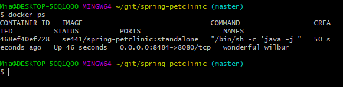
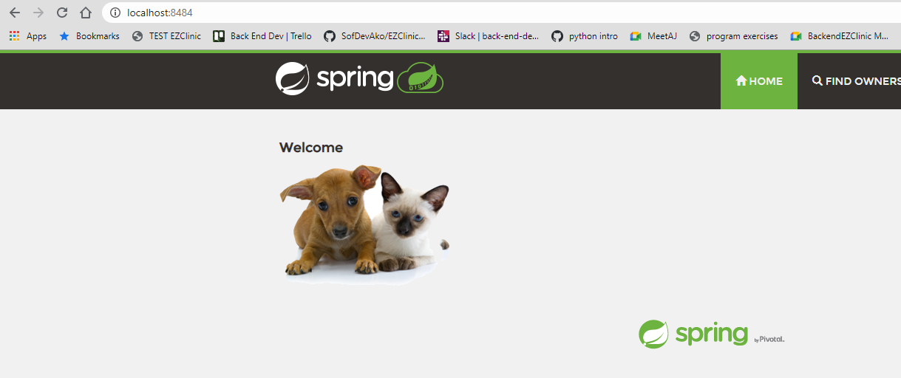
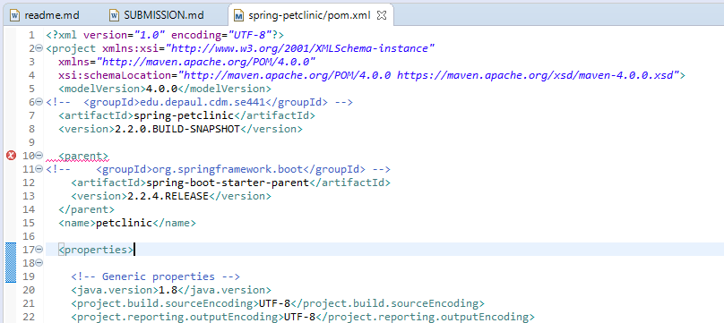

HOMEWORK 8

[DOCKER]
[5 pts] Your dockerfile. Please provide a link to this file rather than a screen capture.
https://github.com/michaeladionglay/spring-petclinic/blob/master/Dockerfile
[5 pts] Your running docker instance as shown by a ps command.

[5 pts] Your browser accessing the main page of the website from your local container.

[DOCKER COMPOSE - MYSQL ONLY]
[5 pts] The output from the docker-compose up command.
[5 pts] Your browser accessing the “Veterinarians” page of the website from your local container when you run the application from the host system.
[5 pts] A section of the stack trace generated when you attempt to run the application container that has been updated to use MySQL.

[DOCKER COMPOSE - APP SERVER AND MYSQL]
[5 pts] Your updated docker-compose.yml file containing the application server, built from your local Dockerfile, and the existing MySQL configuration. Please provide a link to this file rather than a screen capture.
[5 pts] Your updated application-mysql.properties file containing the URL change for the database server. Please provide a link to this file rather than a screen capture.
[5 pts] The output from the docker-compose up command.
[5 pts] Your browser accessing the “Veterinarians” page of the website from your local container.

HOMEWORK 5

For this week, create a new SUBMISSION.md file in your repo. Add the images to a new figures
directory and add links to those images to the SUBMISSION.md file. The images you need are:

[5 pts] Your Github account showing that is has been forked from the depaulcdm/springpetclinic repository.

[5 pts] Your Travis CI dashboard showing a successful first build.

[5 pts] The section of the POM file showing the coordinates after you’ve changed them.

[5 pts] Your Travis CI dashboard showing a successful build after your change of the group ID.

[5 pts] The section of the POM file showing the coordinates after you’ve commented them out.

[5 pts] Your Travis CI dashboard showing the unsuccessful build after the breaking change.

[5 pts] Your Github repository with the readme.md file selected showing the build failed status after the Travis CI build fails.

[5 pts] The section of the POM file showing the coordinates after you’ve fixed them.

[5 pts] Your Travis CI dashboard showing the successful build after the breaking change has been fixed.

[5 pts] Your Github repository with the readme.md file selected showing the build success status after the Travis CI build has recovered.

Submit a link to your repository in D2L. Make sure your Github repository is public.
